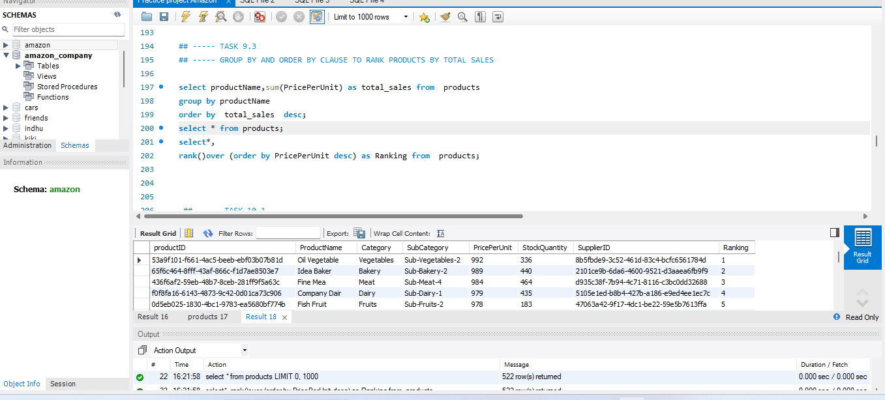
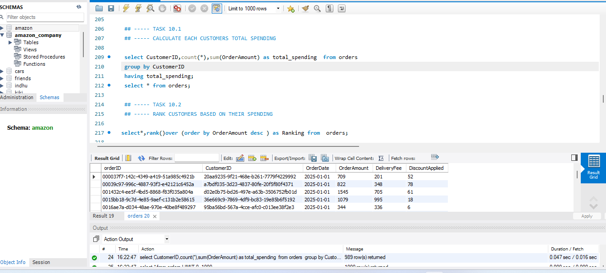

# Amazon Fresh Analytics

## 📊 Project Overview

Analyzed Amazon Fresh data using MySQL to extract meaningful business insights related to sales, products, and customer behavior.

## 🛠️ Tools Used

- MySQL

## 📈 Analysis Performed

- Cleaned and organized the dataset using SQL
- Used filtering and aggregation techniques
- Analyzed sales and product performance
- Examined customer behavior
- Extracted meaningful business insights using SQL queries

## 🎯 Objective

To analyze Amazon Fresh data using SQL and generate meaningful business insights from the dataset.

## 📌 Outcome

The analysis transformed raw Amazon Fresh data into useful insights related to sales, products, and customer behavior using SQL.

## 📊 SQL Analysis Preview

### SQL Analysis – 1

### SQL Analysis – 2

